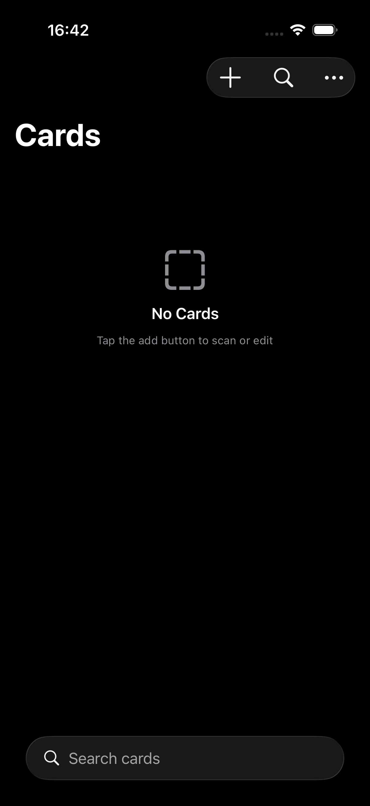
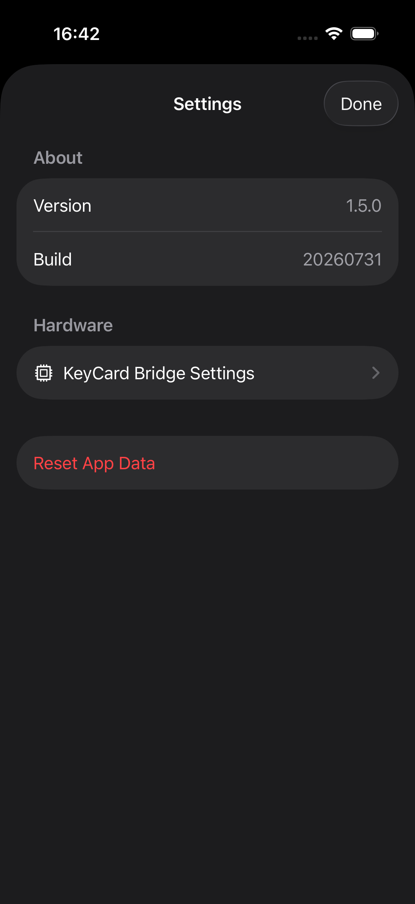
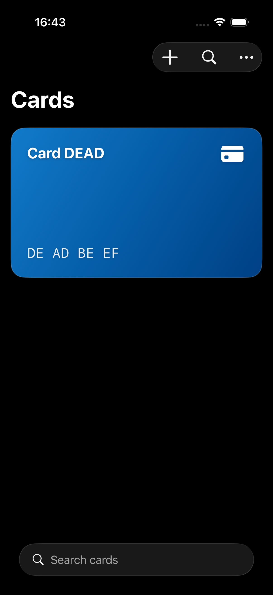
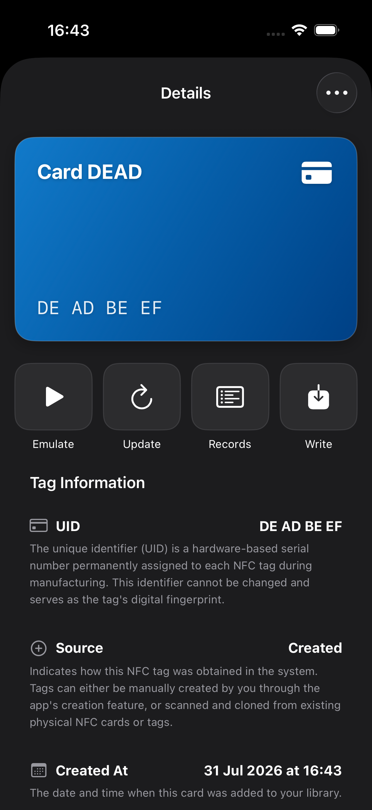
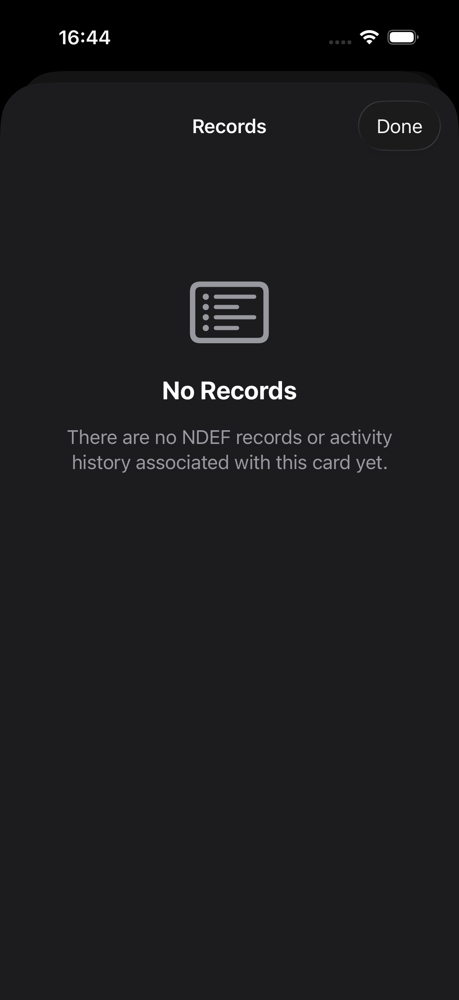
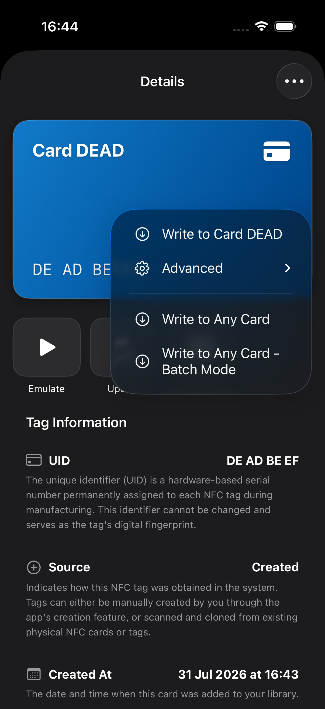
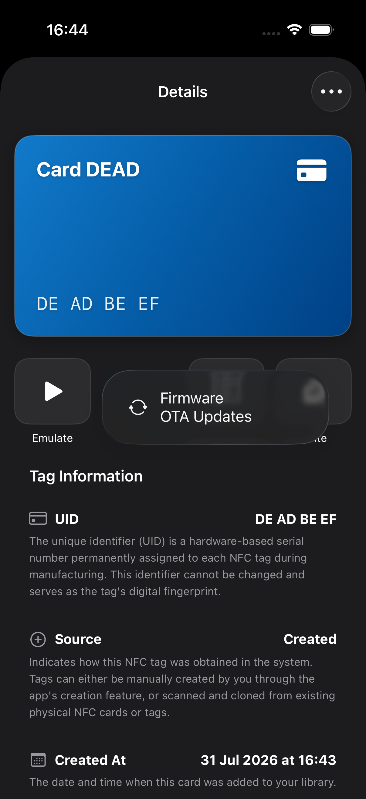
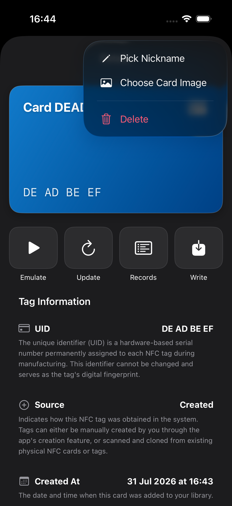
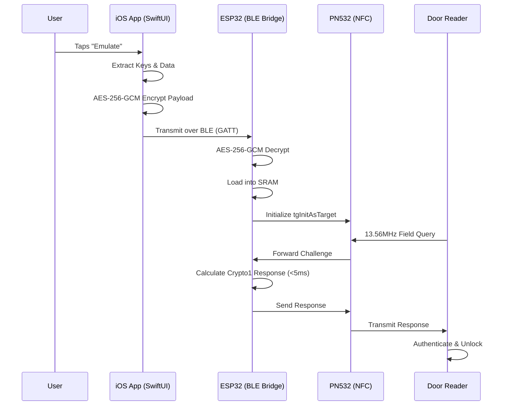

# 🗝️ KeyLink: Universal Mobile Key Platform

**KeyLink** is an open-source hardware and software stack that transforms your iPhone into a universal access key by proxying RFID and NFC emulation through a secure, MagSafe-attached BLE bridge. 

By offloading RF modulation to a miniature ESP32-based proxy device that snaps magnetically to the back of your iPhone, KeyLink completely bypasses Apple's strict NFC hardware locks and CoreNFC limitations—no jailbreaks, no wallet hacks, and no third-party subscription fees required. The end result? You just tap your iPhone to the door.

---

## 📸 Interface Preview

  
  
  
  

  
  
  
  

---

## 📑 Table of Contents

- [Core Features](#-core-features)
- [Supported Protocols](#-supported-protocols)
- [Architecture](#-architecture-how-it-works)
- [Getting Started](#-getting-started)
  - [Hardware Requirements](#1-hardware-requirements)
  - [Firmware Installation](#2-firmware-installation)
  - [iOS Application Build](#3-ios-application-build)
- [Roadmap & Status](#-roadmap--status)
- [Legal & Security Disclaimer](#-legal--security-disclaimer)

---

## ✨ Core Features

* 📱 **Native iOS App:** A beautifully crafted SwiftUI library to manage all your physical keys, badges, and Amiibos with drag-and-drop organization and custom gradient designs.
* 🔒 **End-to-End Encrypted (E2EE):** All BLE traffic is protected via **AES-256-GCM** using a Pre-Shared Key (PSK), ensuring your raw card dumps are safe from packet sniffers and man-in-the-middle attacks.
* 🔄 **Background Reconnection:** Leveraging Apple's CoreBluetooth state restoration, the app automatically wakes up in the background to reconnect with the hardware bridge seamlessly.
* 📦 **Direct `.bin` Import:** Natively import Proxmark3 `.bin` or `.eml` dumps straight from the iOS Files app—eliminating the need for python conversion scripts.
* ☁️ **OTA Firmware Updates:** Seamlessly deploy new ESP32 firmware updates directly from the iOS app via a local Wi-Fi AP.
* 🔐 **Biometric Security:** Integrated `LocalAuthentication` (Face ID / Touch ID) to protect access to sensitive credential data.
* 📸 **Digital Passes:** Built-in camera scanning and `CoreImage` QR generation allows you to store digital passes alongside your physical RF credentials.

---

## 📡 Supported Protocols

KeyLink employs a custom protocol state machine running on the ESP32, enabling high-speed cryptographic handshakes natively.

| Protocol | Status | Features |
| :--- | :---: | :--- |
| **MIFARE Classic (1K/4K)** | 🟢 Full | Real Crypto1 engine, Sector Keys (A/B), Nested Auth, UID Cloning |
| **MIFARE Ultralight / NTAG** | 🟢 Full | Raw page emulation, `FAST_READ`, NTAG215 (Amiibo) `PWD_AUTH` spoofing |
| **HID Prox (125 kHz)** | 🟢 Full | Bit-banged FSK/ASK modulation on GPIO 4 |
| **MIFARE DESFire EV1/EV2** | 🟡 Alpha | ISO-DEP APDU scaffolding, Native/ISO/AES auth state machine (WIP) |
| **DESFire Light** | 🟢 UID Only | ISO/IEC 14443-4 initialization |

---

## 🏗️ Architecture: How It Works

KeyLink consists of two tightly integrated components:

1. **The Software Bridge (iOS):** 
   Acts as your secure command center. It parses `.bin` files, securely stores the data in SwiftData, and handles the encrypted BLE transmission to the bridge.

2. **The Hardware Bridge (ESP32-S3 + PN532):**
   A tiny, battery-powered proxy device designed to snap to the back of your iPhone via MagSafe. It decrypts the BLE payload and loads it into fast SRAM. It configures the PN532 as an active target (`tgInitAsTarget`), bypassing the mobile OS. When a reader queries the bridge, the ESP32 dynamically calculates cryptographic responses in real-time to meet strict `<5ms` timing constraints.

---

## 🌍 Real-World Usage Scenario

Wondering how this all comes together when you're actually standing in front of a door? Here is a step-by-step breakdown of how you use KeyLink in real life:

1. **The Setup (One Time):** You use a Proxmark3 at your desk to dump your apartment building's key fob (e.g., a MIFARE Classic 1K card). You AirDrop the `dump.bin` file to your iPhone and import it into the KeyLink app.
2. **The MagSafe Bridge:** You snap the tiny KeyLink hardware bridge to the back of your iPhone using MagSafe. You turn the bridge on.
3. **Background Auto-Connect:** Thanks to CoreBluetooth State Restoration, your iPhone securely connects to the attached bridge in the background using AES-256-GCM encryption. 
4. **Approaching the Door:** You walk up to your apartment's locked door.
5. **The Emulation:** You open the KeyLink app (authenticating with Face ID), select your "Apartment Fob", and tap **Emulate**. 
6. **The Handshake:** The iPhone securely beams the card's sector keys to the MagSafe bridge on its back. The bridge arms its PN532 NFC chip.
7. **The Unlock:** You tap your iPhone against the door's NFC reader. The MagSafe bridge intercepts the reader's query, processes the cryptographic response, and the door unlocks. To the outside world, you just opened the door with your iPhone!

---

## 🚀 Getting Started

### 1. Hardware Requirements
To build your own KeyLink bridge, you will need the following off-the-shelf components:
* **Microcontroller:** ESP32-S3-DevKitC-1
* **NFC Frontend:** PN532 module (Configured for HSU UART mode via dip switches)
* **Power:** 3.7V 500mAh LiPo battery + TP4056 charging module
* **Misc:** 3.3V to 5V Level Shifter, 1mH coil for 125kHz modulation

*(A complete custom PCB schematic for a compact wearable form factor is currently in development.)*

### 2. Firmware Installation
1. Open the `/Firmware` directory in the Arduino IDE.
2. Install the required dependencies: `elechouse/PN532`, `ArduinoJson`, and ensure your ESP32 board definitions are up to date.
3. Define your custom 32-byte AES-256-GCM Pre-Shared Key (PSK) in `keycard_bridge.ino`.
4. Flash the firmware to your ESP32-S3.

### 3. iOS Application Build
1. Open `/keycard/keycard.xcodeproj` in Xcode 15 or later.
2. Ensure you have an active Apple Developer Team selected for code signing.
3. Update the matching 32-byte AES-256-GCM PSK in `BLEManager.swift`.
4. Build and run the application on your physical iPhone (CoreBluetooth emulation is not supported on the iOS Simulator).

---

## 🗺️ Roadmap & Status

- [x] Basic ESP32 + PN532 emulation
- [x] BLE GATT command protocol
- [x] iOS app: Native `.bin` import and card library
- [x] Initial Crypto1 engine integration in firmware
- [x] Stabilize Crypto1 handshake & nested authentication
- [x] Persistent Card Library (SwiftData + iCloud)
- [x] Amiibo emulation (NTAG215 specific commands)
- [x] 125 kHz Support (HID Prox)
- [x] Firmware OTA Updates via iOS
- [x] End-to-End Encryption (AES-256-GCM)
- [ ] Complete MIFARE DESFire EV1/EV2 APDU stack
- [ ] Finalize Custom PCB fabrication files

---

## ⚠️ Legal & Security Disclaimer

KeyLink is built strictly for **educational and personal use**, empowering users to emulate physical access badges and tags that **they already legally own**. 

It is expressly not designed, nor should it be used, as a tool for unauthorized access, malicious cloning, or commercial circumvention. The developers assume no liability for the misuse of this platform. Use responsibly and obey all local laws.

---
*©️ 2026 Henriques Pontes, All rights reserved.*